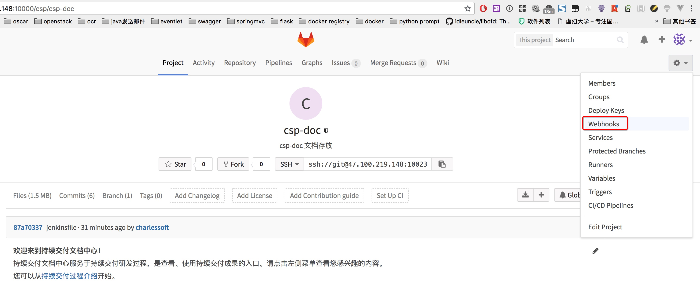

# 持续交付平台使用手册

## 新建持续构建job
1. 新建设任务

2. 配置任务
在配置页面中,输入项目的git地址,保存.

3. 至此配置完成,返回页面,点击立即构建, 如果有参数构建,点击Build with Parameter(填写发布分支,该分支需要在远程分支上存在)

## 高级选项
1. 配置额外信息

  + 每日构建
    
  	例如每日9点钟开始构建 **H 9 * * ***, 建议直接在Jenkinsfile中直接写入构建时间(由Jenkinsfile维护),会同步到该配置中.

  + 提交立即编译

    1. 在构建触发器点击Gererate按钮生成token,由gitlab中项目配置,如下所示:
Gitlab webhook URL:http://jenkins.basin.site:9090/project/helloworld  
Secret token 2e25eac0d4f551a2b47ece27f88d257d  
需要把两项配置中,填入gitlab的webhook配置项

    2. 登录gitlab服务器
    点击项目地址,选择webhook配置项目信息
    
填入第2步获取到的**url**和**secret token**
 
    + 点击Add Webhook

2. 指定参数编译工程
   Jenkins依据指定的GIT_TAG,编译工程,此GIT_TAG必须在远程分支上存在,例如编译relaese/dev-0.4版本,该分支需要已提交到远程分支上
   
## 示例工程:

+ [helloworld.tar.gz](./assets/helloworld.tar.gz)

