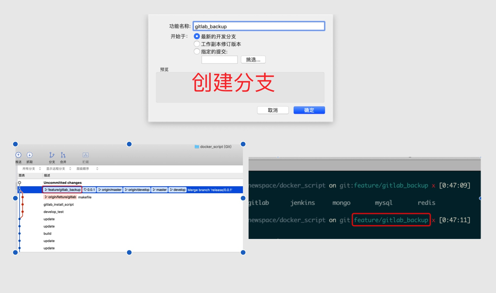
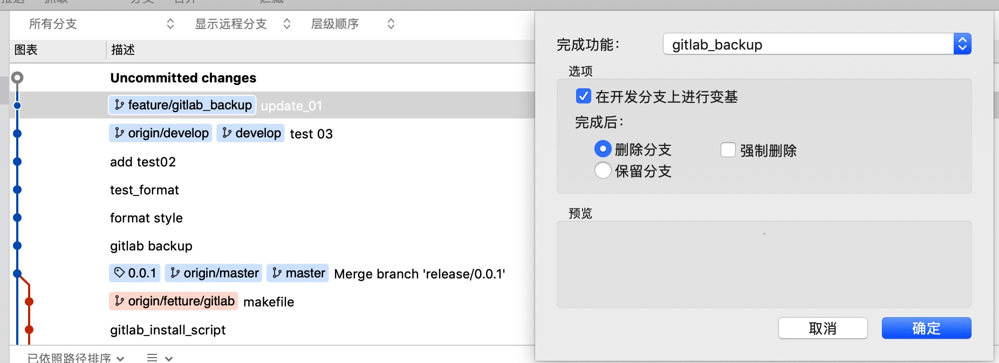
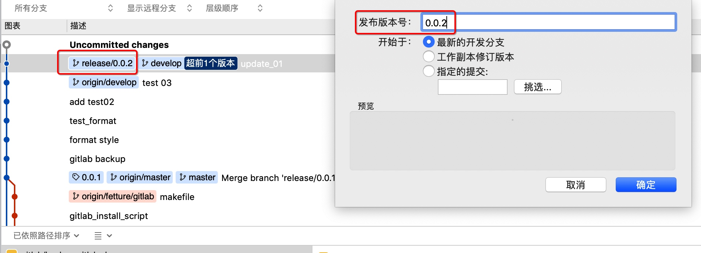
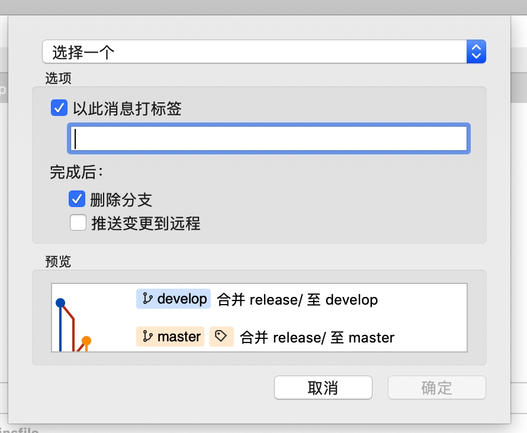
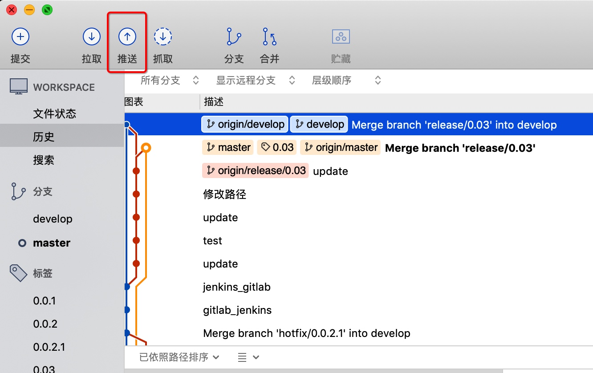
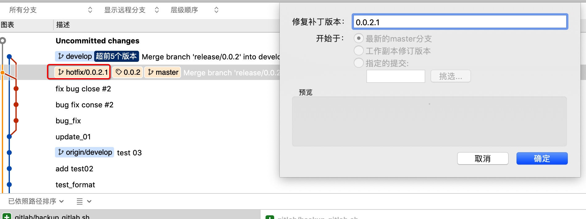
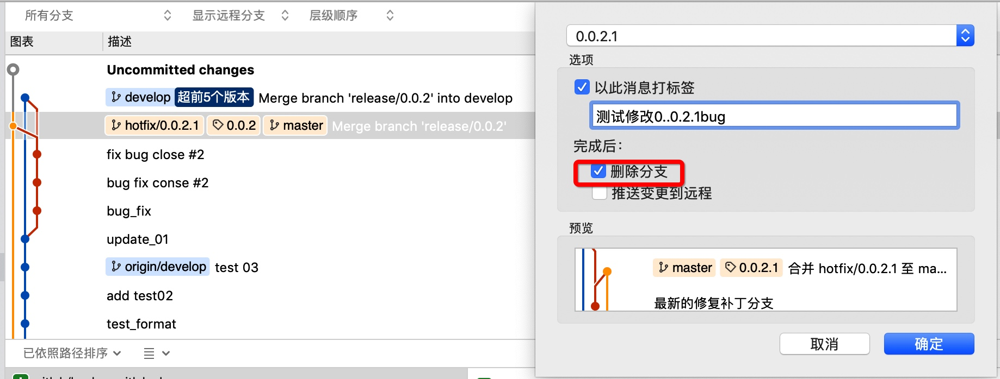
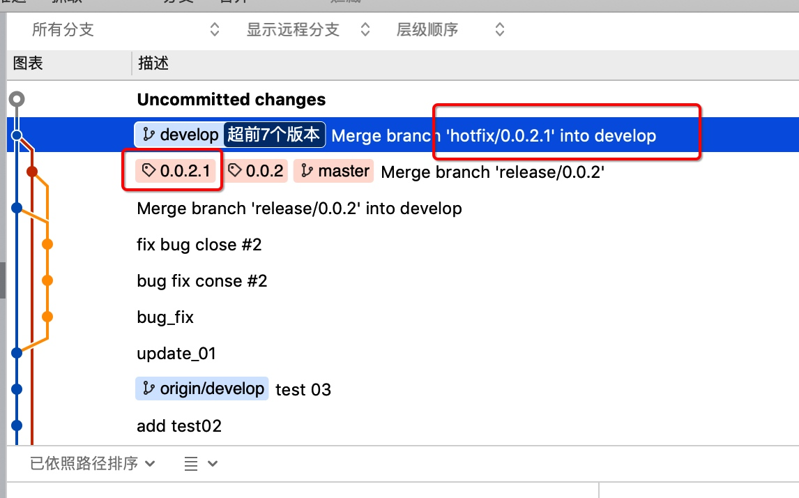
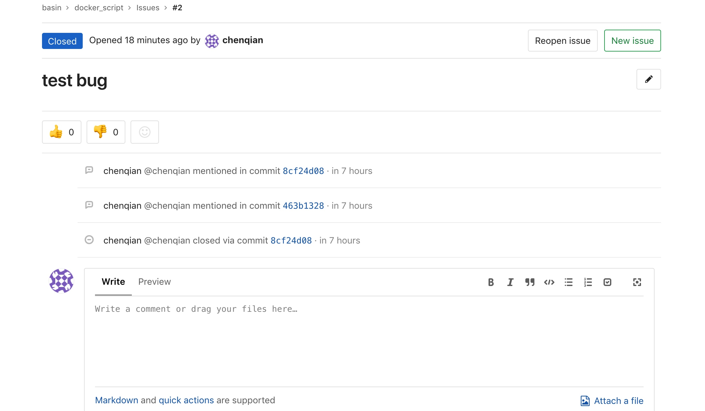

# git flow

核心内容, master 不能被修改,由管理员来合并分支

版本定义
v1.0.0
1. 大的版本,功能版本, 0,修复


客户端工具,推荐使用source tree
操作步骤:
1. 初始化仓库
    + 生产环境分支 master (任何时刻都是包含最新release,原始代码)
    + 开发分支  develop
    + 功能分支前缀 feature/
    + 发布分支前缀 release/
    + 补丁分支前缀 hotfix/

git 始终围绕3个动作,
+ 建立新功能(完成新功能)
+ 建立新的发布版本(完成新发布版本)
+ 建立新的修复补丁(完修复补丁)


基于master 切换到develop分支,推送到远程仓库,所有开发工作,必须在develop下完成

需要开发功能,基于 develop开发
## 新增功能

#### 新增功能
一般在最新的`开发分支develop`上开分支

+ 命令行:
    ```
    git-flow feature start MYFEATURE
    ```
+ 客户端创建分支


创建一个基于 develop分支的 MYFEATURE feature 分支，并切换到该分支下


#### 开发完毕合并到develop(完成功能分支)

+ 命令行
    ```
    git flow feature finish MYFEATURE
    ```
+ 客户端

会动合并到develop分支,并且删除分支
在这期间,本地分支可以提交,也可以不提交,通过jenkins编译该分支,

完成开发新特性，合并 MYFEATURE 分支到 develop，删除这个新特性分支，并切换回 develop 分支


发布新特性分支到远程服务器

```
git flow feature publish MYFEATURE
```

更新其它用户发布的新特性分支

```
git flow feature pull origin MYFEATURE
```


## (预)发布分支
release分支由`develop分支`发起,将分支代码编译,部署到测试环境

+ 命令行
    ```
    git flow release start RELEASE [BASE]
    创建 RELEASE 分支，可选参数 BASE 是 develop 分支提交记录的 sha-1 hash 值，用来启动 release 分支
    ```
+ 客户端



在此期间需要做的事情:
1. review 代码
2. 响应测试反馈bug 在该分支修改

如果有修改,或者发现bug再此版本上修改.修改完毕.确认可以发布了,推送到develop和master分支上,保证develop和master 一致.

## 完成发布分支

+ 命令行

    ```
    git flow release finish RELEASE
    ```
+ 客户端
填写tag 信息,此tag 作为最终发布的release版本.


确认发布后,选择推送, 成功后就会合并master/develop(作为最新文档版本) 同时在release地址会出现发布的tag



## hotfix 分支（紧急修复线上版本bug）
从master或者多个版本的分支检出


在代码中修改bug,修复后选择完成修复.






完成修复,并提交到服务器,在输入标签中可以写 close #1(issue id) ,会自动关闭close,并且与该bug修复代码 commit 都可以追溯



修复的release,也会在tag中展示,

