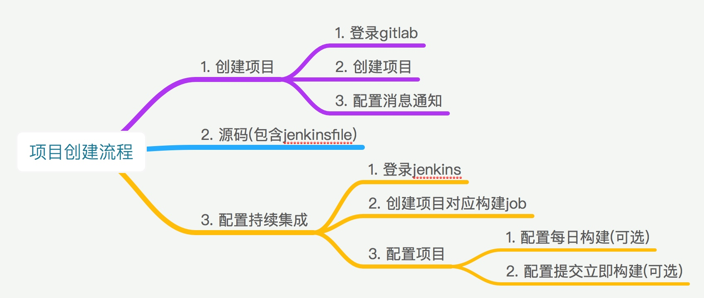
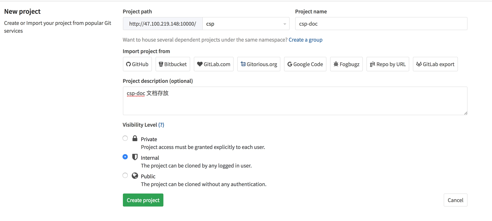
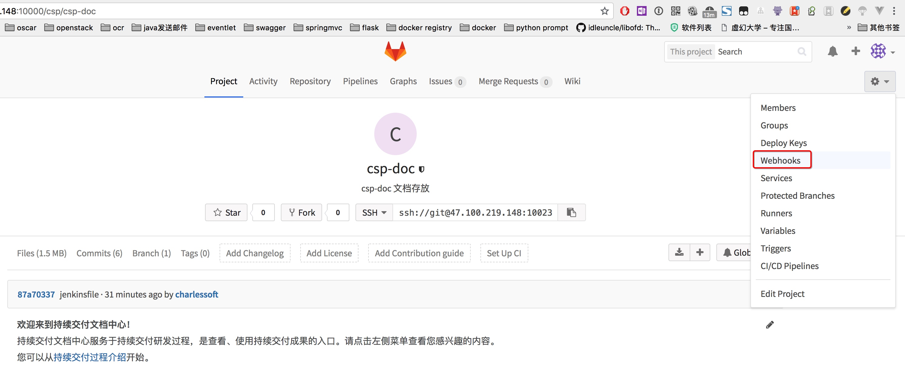
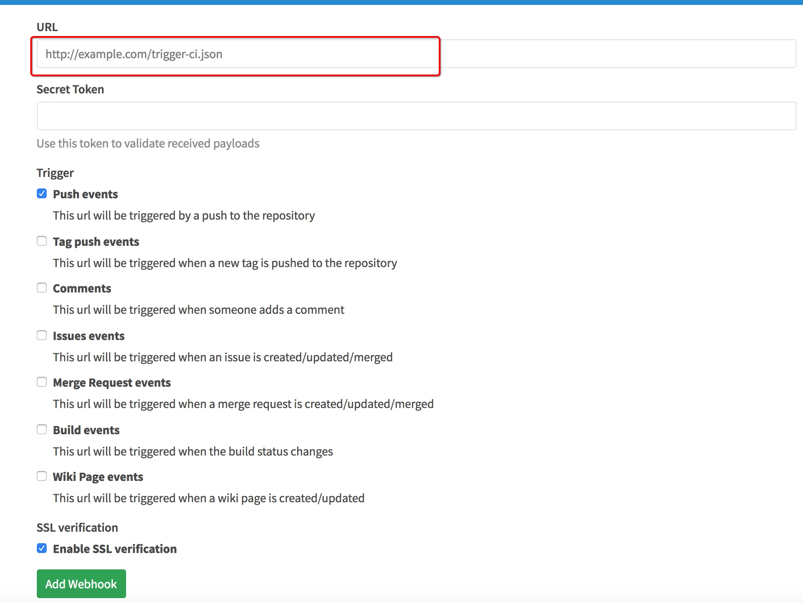

# 项目创建流程



## 场景1 创建项目

新增项目必须要包括以下工作内容:

    1. 纳入持续集成(见持续交付平台使用手册)
    2. 消息通知,包含push和创建issue通知
    3. 源码包含Jenkinsfile 
    	3.1 打包发布到私有仓库（可选）
    	3.2 打包发布到发布服务器

    
### 初始化代码
1. 包含Jenkinsfile模板示例如下, post部分可以直接复制.
2. Jenkinsfile 主要依据定义statge来执行步骤
	+ stage('checkout') -->检出代码（直接复制）
	+ stage('build-image') -> 编译镜像（可以调用本地的shell脚本）
	+ stage('test') -> 测试（可选）
	+ stage('package') -> 打包（可以调用本地shell脚本）
	+ stage("SonarQube analysis") ->SonarQube 分析（可选，暂不用，里头包含了登录token,需要全局设置）
	+ stage('publish snapshots') -> 发布到snapshots目录（每日构建版本，不稳定版本,只需要修改  
	                                                 removePrefix: 'dist/docker_images',  
                                                    sourceFiles: 'dist/docker_images/  
	+ stage('publish release')  -> 与publish snapshots一样（正式版本发布）
	+ post ->往钉钉发送消息（直接复制）  
	
	stage可以自行增加执行步骤
	                                                   

```
pipeline {
    agent any
    options {
    ansiColor('xterm')
    }
    triggers {
        // 每天9点构建
        cron('H 9 * * *')
    }
    parameters { 
        // 在此添加 如果需要增加编译参数
        string(defaultValue: 'latest', name: 'GIT_TAG', description: '默认master\n1.指定branch/tag' )
        booleanParam(name: 'NEED_PACKAGE', defaultValue: true, description: '是否打包') 
    }
    stages {
        stage('checkout') {
            steps {
                echo "========="
                    echo "检出源码"
                    script {
                        if (env.GIT_TAG == 'latest') {
                                sh '''
                            git checkout -b ${GIT_TAG}
                            '''
                        } else{
                            sh '''
                            git checkout  ${GIT_TAG}
                        '''
                        }
                    }
                    echo "========="
            }
        }

        stage('build-image') {
            steps {
                echo '======================================='
                    echo '编译镜像'
                    echo '======================================='
                    //sh 'docker build -t demo_hellowrld:latest .'
                    sh 'tar zcvf demo_hellowold.tar.gz main.py'
            }
        }

        stage('test') {
            steps {
                echo '======================================='
                    echo 'test..'
                    echo '======================================='
            }
        }

        stage('package') {
            steps {
                echo '======================================='
                    echo '打包编译文件'
                    echo '======================================='
                script {
                        echo env.NEED_PACKAGE
                        if (env.NEED_PACKAGE) {
                            sh """
                            #export GIT_TAG=${GIT_TAG}
                            #cd ${WORKSPACE}
                            #bash package.sh
                            #make build_tar_gz
                            """
                        } else {
                            echo "nonononono need package...."
                            // echo "指定编译版本 ${GIT_TAG},发布到指定目录"
                        }
                    }
            }
        }
        
        stage("SonarQube analysis") {
            steps {
                echo '======================================='
                echo 'SonarQube 源码分析'
                echo '======================================='
                withSonarQubeEnv('sonarqube') {
                    //sh 'mvn sonar:sonar -Dsonar.host.url=http://sonarqube.basin.ali:9000 -Dsonar.login=78de1d060cdffc09fcfc0047be15ac0a5f50d2e0'
                    // sh '''
                    //   docker run --rm -v $(pwd):/root/src  \
                    //     --add-host sonarqube.basin.ali:47.100.219.148 \
                    //     zaquestion/sonarqube-scanner sonar-scanner \
                    //     -Dsonar.host.url=http://sonarqube.basin.ali:9000 \
                    //     -Dsonar.login=78de1d060cdffc09fcfc0047be15ac0a5f50d2e0 \
                    //     -Dsonar.projectKey=basin-${JOB_NAME} \
                    //     -Dsonar.projectName="${JOB_NAME}" \
                    //     -Dsonar.projectVersion=1 \
                    //     -Dsonar.language=py  \
                    //     -Dsonar.python.pylint=/usr/bin/pylint \
                    //     -Dsonar.sources=./
                    // '''
                }
            }
            //其他语言
        }
        stage('publish snapshots') {
             steps {
                echo '======================================='
                echo '发布到snapshots'
                echo '======================================='
                script {
                    if(env.GIT_TAG=='latest'){
                        sshPublisher(
                            publishers: [
                                sshPublisherDesc(
                                    configName: 'release-server',
                                    transfers: [
                                            sshTransfer(
                                                    // excludes: '**/ambari-metrics-assembly*.rpm',
                                                    execCommand: '',
                                                    execTimeout: 120000,
                                                    flatten: false,
                                                    makeEmptyDirs: false,
                                                    noDefaultExcludes: false,
                                                    patternSeparator: '[, ]+',
                                                    remoteDirectory: "${JOB_NAME}/snapshots",
                                                    remoteDirectorySDF: false,
                                                    //removePrefix: 'dist/docker_images',
                                                    //sourceFiles: 'dist/docker_images/*.tar,dist/docker_images/*.tar.gz'
                                                    removePrefix: '',
                                                    sourceFiles: '*.tar.gz'
                                            )
                                    ],
                                    usePromotionTimestamp: false,
                                    useWorkspaceInPromotion: false,
                                    verbose: true
                                )
                            ]
                        )
                    }
               }
            }
        }
        stage('publish release') {
             steps {
                echo '======================================='
                echo '发布到releases'
                echo '======================================='
                script {
                    if(env.GIT_TAG != 'latest'){
                        sshPublisher(
                            publishers: [
                                sshPublisherDesc(
                                    configName: 'release-server',
                                    transfers: [
                                            sshTransfer(
                                                    // excludes: '**/ambari-metrics-assembly*.rpm',
                                                    // excludes: '**/*.tar',
                                                    execCommand: '',
                                                    execTimeout: 120000,
                                                    flatten: false,
                                                    makeEmptyDirs: false,
                                                    noDefaultExcludes: false,
                                                    patternSeparator: '[, ]+',
                                                    remoteDirectory: "${JOB_NAME}/release",
                                                    remoteDirectorySDF: false,
                                                    //removePrefix: 'dist/docker_images',
                                                    //sourceFiles: 'dist/docker_images/*.tar,dist/docker_images/*.tar.gz'
                                                    removePrefix: '',
                                                    sourceFiles: '*.tar.gz'
                                            )
                                    ],
                                    usePromotionTimestamp: false,
                                    useWorkspaceInPromotion: false,
                                    verbose: true
                                )
                            ]
                        )
                    }
               }
            }
        }
    }
    //post 这段直接复制
    post {
         always {
             echo 'One way or another, I have finished'
             deleteDir() /* clean up our workspace */
         }
        success {
            httpRequest consoleLogResponseBody: true, contentType: 'APPLICATION_JSON_UTF8', httpMode: 'POST', ignoreSslErrors: true, requestBody: """{
                "msgtype": "link",
                    "link": {
                        "title": "${env.JOB_NAME}${env.BUILD_DISPLAY_NAME} 构建成功",
                        "text": "项目[${env.JOB_NAME}${env.BUILD_DISPLAY_NAME}] 构建成功，构建耗时 ${currentBuild.durationString}",
                        "picUrl": "http://icons.iconarchive.com/icons/paomedia/small-n-flat/1024/sign-check-icon.png",
                        "messageUrl": "${env.BUILD_URL}"
                    }
            }""", responseHandle: 'NONE', url: "${env.DINGDING_SERVER}"
        }
        failure {
            httpRequest consoleLogResponseBody: true, contentType: 'APPLICATION_JSON_UTF8', httpMode: 'POST', ignoreSslErrors: true, requestBody: """{
                "msgtype": "link",
                    "link": {
                        "title": "${env.JOB_NAME}${env.BUILD_DISPLAY_NAME} 构建失败",
                        "text": "项目[${env.JOB_NAME}${env.BUILD_DISPLAY_NAME}] 构建失败，构建耗时 ${currentBuild.durationString}",
                        "picUrl": "http://www.iconsdb.com/icons/preview/soylent-red/x-mark-3-xxl.png",
                        "messageUrl": "${env.BUILD_URL}"
                    }
            }""", responseHandle: 'NONE', url: "${env.DINGDING_SERVER}"
        }
    }
}


```


### 创建项目
1. 登录gitlab服务器http://gitlab.basin.site:10000
2. 点击右上角New Project按钮,新建工程
3. 填写项目信息和所属Group


### 配置项目
+ 配置消息通知 

点击项目地址,选择webhook配置项目信息


在url中输入https://oapi.dingtalk.com/robot/send?access_token=2e3244a8f7acdad9bd4696538618b87892010e04fd0a75c7262a66b2953888f2 (发送到平台部-技术中心) 参见备注 ,钉钉通知，参见钉钉群机器人配置

点击Add Webhook

+ 配置jenins立即编译(可选) 参见持续交付平台使用


    
## 场景2 迁移项目
旧平台项目迁移到新平台中,操作步骤:
1. 新建项目参见上一节(新建项目)
2. 修改本地项目配置.git/config的url地址为新项目地址


3. 在终端git push origin master 提交代码


## 示例代码
+ [helloworld.tar.gz](./assets/helloworld.tar.gz)


## 备注:

###  群[平台部-技术中心]钉钉机器人token:
+ webhook 机器人
https://oapi.dingtalk.com/robot/send?access_token=b03d6704967c55e168943a2db03452d0b3f41224275010bacfe5ca23db00c20c

+ gtlab 机器人
https://oapi.dingtalk.com/robot/send?access_token=2e3244a8f7acdad9bd4696538618b87892010e04fd0a75c7262a66b2953888f2


